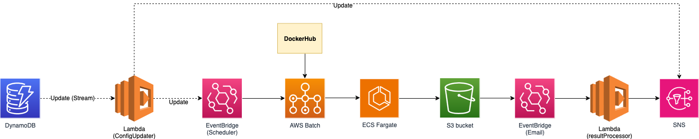

# Screener Scheduler Guide
This use case is meant to help you run Screener automatically at your desired frequency, so that you can have a good view of what has changed since the last run without the need to constantly re-deploy. Below is the setup guide for you to deploy in your AWS environment. 

## Architecture Components
### Components

From left to right
1. DynamoDB: This stores your various configurations for different schedulers. Each configuration consists of environment variables used to run Screener, and the email recipient for the summary email
2. Lambda - ConfigUpdater: This lambda will be triggered using DynamoDB Streams. It updates the EventBridge Scheduler setting, parameters, and SNS topic recipients
3. EventBridge - Scheduler: This is the main component for performing the scheduled event. Based on the Scheduler setting, EventBridge triggers AWS Batch to run Screener
4. AWS Batch: It consists of job definition, job queue and jobs that will create use ECS Fargate to run Screener, and will be shut down after each complete run. For container compute allocation, it will first utilise Spot instances. If not available, then it will fall back on On Demand instances.
5. ECS Fargate: This will be created by AWS Batch to run Screener commands and upload the results to S3.
6. S3 bucket: Stores the output.zip summary and excel findings for each account
7. EventBridge - Email: Based on S3 event of uploaded *.zip, it will trigger Lambda to process the findings.
8. Lambda - resultProcessor: Identifies high findings and compare with the previous run to identify changes, new findings or what has been resolved.
9. SNS: Sends the summary of findings to the email recipients. 


### Costs 
The actual cost incurred will depend on the frequency of execution, the number of configurations, amount of resources and number of accounts you are scanning. You may refer to [cost calculator here](https://calculator.aws/#/estimate?id=bae7c90fbe563768fd4c5d2726f3a8476ed190a0) for exact calculations. Following are some estimates based on different scenarios:

- Configs: 5, Schedule: Weekly. $0.42/Month or $5/Year. 
- Configs: 1, Schedule: Weekly. $0.1/Month or $1.2/Year
- Configs: 1, Schedule: Monthly. $0.025/Month or $0.3/Year

## Deployment Guide (Recommended to run in Cloudshell)
### Prerequisite - Permission 
1. AWS User Console access
1. cloudshell:FullAccess, 
1. cloudFormation:CreateStack, DeleteStack,
1. dynamoDB:CreateTable, EnableKinesisStreamingDestination, UpdateKinesisStreamingDestination, Describe*, ListStreams
1. s3:CreateBucket, PutLifecycleConfiguration
1. batch:CreateComputeEnvironment, CreateJobQueue, RegisterJobDefinition, UpdateComputeEnvironment, SubmitJob, UpdateJobQueue, CreateSchedulingPolicy, UpdateSchedulingPolicy
1. eventbridge:Create*
1. scheduler:Create*
1. lambda:Create*


### Prereqsuite - running in your own environment 
Note: All the following is already preinstalled for you in  your Cloudshell environment
1. Python3.12 & pip3
1. awscli & awscdk
1. Docker

### Cloudshell
The deployment requires 1/ CDK, 2/ git, 3/ docker and 4/ aws-cli. Using AWS Cloudshell is the cleanest and easiest way to deploy.
1. Login to AWS Console
1. Access Cloudshell
1. Run the following commands
```
## Perform normal Screener setup
python3 -m venv .
source bin/activate
python3 -m pip install --upgrade pip
rm -rf service-screener-v2
git clone https://github.com/aws-samples/service-screener-v2.git
cd service-screener-v2
pip install -r requirements.txt
```
```
## Set up your environment variables to deploy the infrastructure
export NAME="<insert config name>" 
export EMAIL_LIST="<insert email>"
export SERVICES="<insert services | leave it BLANK to scan all services>" 
export REGIONS="<insert regions | leave it BLANK to scan all regions>" 
export FREQUENCY="<insert cron expression>" 
export CROSSACCOUNTS="<ProperCrossAccountsJSON or empty>"
export BUCKET_NAME="<insert name>" 

### Example
export NAME="scheduler-sample" 
export EMAIL_LIST="scheduler@amazon.com"
export SERVICES="ec2,rds" 
export REGIONS="ap-southeast-1, us-east-1"
export FREQUENCY="cron(1 9 * * ? *)" 
export CROSSACCOUNTS='{"general": {"IncludeThisAccount": true,"RoleName": "OrganizationAccountAccessRole","ExternalId": ""},"accountLists": {"123456789": {}}}'
export BUCKET_NAME="example-scheduler"
```

Here are some example on FREQUENCY format
```
# Run weekly on every Sunday at 0030 UTC
cron(30 0 ? * SUN *) 

# Run monthly on every 28th of the month at 0500 UTC
cron(0 5 28 * ? *)

# Run daily at 2315 UTC
cron(15 23 * * ? *)
```

```
## Deploy the architecture
export AWS_DEFAULT_REGION=<YOUR_REGION>
cd usecases/scheduler/src/infra
pip install -r requirements.txt
cdk synth 
cdk bootstrap
cdk deploy 

## cdk deploy will ask if you wish to deploy the changes, type "y" and press "enter"

## After CDK deploy finish, run the following commands to insert the first configuration to dynamodb
chmod +x ./deploy.sh
./deploy.sh
```

After the item has been inserted into DynamoDB, an EventBridge Scheduler and SNS topic will be created. Check the email you exported as environment variable previously and confirm the subscription. This email will receive the updates whenever Service Screener runs.

## Configuration
The configuration setup is to be done in DynamoDB, a table called: <TODO>
- name (string, key): unique configurationId
- frequency (string): cron syntax
- emails (stringset): list of recipients to receive Screener reports
- regions (stringset): valid [list of regions](https://docs.aws.amazon.com/AmazonRDS/latest/UserGuide/Concepts.RegionsAndAvailabilityZones.html). e.g: ap-southeast-1 | us-east-1 | ALL
- services (stringset, optional): leave it empty to scan all supported services, else you can refers to [list of valid services here](https://github.com/aws-samples/service-screener-v2/tree/main/services)
- crossAccounts (string, optional): need to upload a valid crossAccounts.json here. You can refers to [this sample](https://github.com/aws-samples/service-screener-v2/blob/main/crossAccounts.sample.json) or [follows this](https://github.com/aws-samples/service-screener-v2/tree/main/usecases/accountsWithinOrganization) to generate the json if the list of accounts are within the same Organization.

## Troubleshooting
### CDK Bootstrap Failed
1. Go to CloudFormation console and search for "CDKToolKit", if the account previously has failed deployment on this, you have to remove it first and rerun "CDK bootstrap". 
1. Please make sure the IAM role has the permission to perform `iam:CreateRole` action

### CDK Deploy Failed
1. Make sure your CDK bootstrap `region` is same as the one used for CDK deploy. You can either 1/ export AWS_DEFAULT_REGION=<YOUR_REGION>, or 2/ cdk deploy --profile <YOUR_PROFILE>


### Invalid Cron
1. Check logs in cloudwatch in the configUpdater lambda to identify error
1. Make sure your cron is in valid format, you may tap on [this site](https://www.freeformatter.com/cron-expression-generator-quartz.html) to understand better
1. Go to dynamodb and update the *frequency*. The value should consists *cron(YOUR_PATTERN)*, e.g: cron(* * * ? * 1 *)

### Not receiving reporter email
1. Check logs in cloudwatch in the resultProcesser lambda to identify error
1. Next you can go to the S3 Bucket to check if file exists. The key should have the following pattern bucketname/dynamodbKey/YYYYMMDD/AWS_ACCOUNTID/workItem.xlsx ... if files not exists, likely AWS Batch does not run properly due to configuration or permission errros, go to next step
1. Next you can go to AWS Batch to look for any jobs' errors
1. Next you can go to AWS SNS, select topic with prefix, make sure you subscribe to the email notification

### Useful Logs for troubleshooting AWS Batch
1. AWS Batch => Jobs => click on the failed job => Logging. This consists of the container cli output.
1. AWS Batch => Jobs => click on the failed job => JSON. Looks at the values "container" => "environment", make sure values are valid and no typo. Typical typo can be 1/ AWS Region names (wrong e.g: us-east1, ap-south-east-1, apsoutheast-1, ap-north-1a), 2/ typo on services name, 3/ if you are using CrossAccounts, please refers to the sample here.
1. If all failed, please raise a github issue and provide the above 2 informations.

### Author
1. Ying Ting
1. Wanich Keatkajonjumroen
1. KuetTai